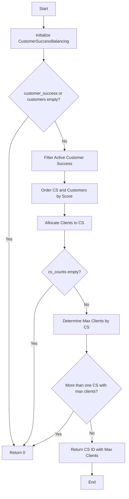

## Projeto: Customer Success Balancing [](https://github.com/aralyne/-CustomerSuccessBalancing/actions/workflows/main.yml)

## Descrição:
Este código fornece uma solução para equilibrar a alocação de Clientes (também chamados de CS) para os Customer Success Managers (CSMs) com base no score. Cada cliente possui um score, e o objetivo é alocar cada cliente ao CSM cujo score é mais próximo, mas não menor que o do cliente. Se houver um empate na quantidade de clientes para dois ou mais CSMs, a solução retornará 0.

## Solução:



1. **Filtragem de CS Ativos**: Primeiro, removemos os CSs que não estão disponíveis. Esta etapa é realizada usando uma estrutura de dados `Set` para eficiência.

2. **Ordenação por Pontuação**: Tanto os CSs quanto os clientes são ordenados com base em suas pontuações. Isso nos permite alocar clientes a CSs de maneira eficiente.

3. **Alocação de Clientes a CSs**: Usando uma abordagem de dois ponteiros, percorremos os arrays de clientes e CSs para fazer a alocação. A ideia é associar cada cliente ao CS mais qualificado disponível, atualizando um contador de clientes por CS.

4. **Determinação do CS com Maior Carga**: Por fim, identificamos o CS que atende ao maior número de clientes. Em caso de empate, não retornamos nenhum CS específico (representado por 0). 

## Princípios de Clean Code Aplicados

- **Nomes Descritivos**: Usamos nomes de variáveis e métodos que descrevem claramente sua funcionalidade.
- **Funções Pequenas**: Cada função tem um propósito único, o que facilita a manutenção e a compreensão.
- **Evitar Comentários Desnecessários**: O código é autoexplicativo.
- **Utilização de Métodos Privados**: Isolamos a lógica específica em métodos privados para encapsulamento.
- **Estruturação do Código**: O código é estruturado de uma forma que facilita a leitura e o entendimento do fluxo da aplicação.

## Como Executar

1. Clone este repositório.
2. Certifique-se de ter Ruby instalado em sua máquina.
3. Execute o script principal:

```bash
ruby path_to_file/customer_success_balancing.rb
```
